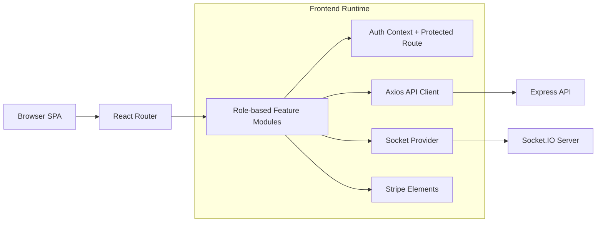

# ApnaManager Frontend

> Enterprise-grade React dashboard for hotel guest operations, police verification workflows, and regional administration.

[](https://react.dev/)
[](https://vite.dev/)
[](https://tailwindcss.com/)
[](https://reactrouter.com/)
[](https://socket.io/)
[](https://stripe.com/)

---

## Table of Contents

- [Overview](#overview)
- [Architecture](#architecture)
- [Tech Stack](#tech-stack)
- [Role-Based App Areas](#role-based-app-areas)
- [Key Frontend Features](#key-frontend-features)
- [Project Structure](#project-structure)
- [Getting Started](#getting-started)
- [Environment Variables](#environment-variables)
- [Available Scripts](#available-scripts)
- [Deployment](#deployment)
- [Troubleshooting](#troubleshooting)
- [Contributing](#contributing)

---

## Overview

ApnaManager frontend is a role-based single-page application built for operational clarity and fast, secure workflows.

It provides:

- **Hotel users** - Guest registration, room operations, reports, and subscription handling.
- **Police users** - Guest search, flags/reports, analytics, and case insights.
- **Regional Admins** - Hotel/police management, station management, watchlist and access log oversight.

The app uses cookie-based authenticated API calls, realtime socket updates, and route-level protection for a secure user experience.

---

## Architecture



### Layered Frontend Design

| Layer | Responsibility |
|---|---|
| **pages/** | Route-level screens grouped by domain (public, hotel, police, admin, shared) |
| **features/** | Domain logic and stateful workflows |
| **components/** | Reusable UI blocks, dashboard widgets, and layouts |
| **api/** + **services/** | API client, request wrappers, report integrations |
| **context/** | App-wide providers (socket lifecycle) |
| **hooks/** | Shared behavior (auth, notifications, data fetching) |
| **lib/** | Utilities, navigation config, PDF helpers |

---

## Tech Stack

| Category | Technology |
|---|---|
| UI Framework | React 19 |
| Build Tool | Vite 7 |
| Styling | Tailwind CSS + PostCSS |
| Routing | React Router 7 |
| HTTP Client | Axios (with credentials enabled) |
| Realtime | Socket.IO Client |
| Payments | Stripe.js + React Stripe Elements |
| Animations | Framer Motion + Lottie |
| Reporting | jsPDF + jsPDF AutoTable |
| Image Handling | browser-image-compression + react-webcam |
| Notifications | react-hot-toast |
| Linting | ESLint 9 |

---

## Role-Based App Areas

| Role | Base Route | Core Capabilities |
|---|---|---|
| Hotel | `/hotel/*` | Dashboard, register guest, guest list, room management, reports, subscription |
| Police | `/police/*` | Dashboard, guest search, flags, analytics, case reports |
| Regional Admin | `/regional-admin/*` | Manage hotels, inquiries, police, stations, watchlist, access logs |
| Public | `/`, `/login`, `/why-us`, `/hotel-registration` | Landing, authentication, hotel onboarding |

All private areas are guarded by a centralized protected route wrapper.

---

## Key Frontend Features

### Security and Session UX
- Cookie-based requests enabled via `withCredentials` in the API client
- 401 interceptor flow with session-expiry handling and redirect to login
- Auth bootstrap on app start through profile loading

### Realtime Experience
- Socket connection lifecycle managed in a dedicated context provider
- Auto connect/disconnect based on authenticated user state

### Operational Workflows
- Multi-role dashboards with role-specific navigation
- Guest onboarding capabilities including camera capture and image optimization
- Reporting support with PDF/table export utilities
- Stripe-powered subscription/payment integration

### Performance and Delivery
- Manual Vite chunk splitting for heavy libraries (PDF, animation, icons, vendor)
- SPA route rewrites configured for production hosting

---

## Project Structure

```text
client/
├── index.html
├── vite.config.js
├── tailwind.config.js
├── postcss.config.js
├── eslint.config.js
├── vercel.json
├── src/
│   ├── App.jsx
│   ├── main.jsx
│   ├── index.css
│   ├── api/
│   │   └── apiClient.js
│   ├── components/
│   │   ├── Dashboard/
│   │   ├── layout/
│   │   └── ui/
│   ├── context/
│   │   └── SocketContext.jsx
│   ├── features/
│   │   ├── auth/
│   │   ├── admin/
│   │   ├── hotel/
│   │   ├── police/
│   │   ├── guest/
│   │   └── user/
│   ├── hooks/
│   │   ├── useAuth.js
│   │   ├── useFetchData.js
│   │   └── useNotifications.jsx
│   ├── lib/
│   │   ├── navigation.jsx
│   │   ├── pdfGenerator.js
│   │   └── utils.js
│   ├── pages/
│   │   ├── public/
│   │   ├── hotel/
│   │   ├── police/
│   │   ├── admin/
│   │   └── shared/
│   └── services/
│       └── reportService.js
└── package.json
```

---

## Getting Started

### Prerequisites

- Node.js 20+
- Backend API running locally or remotely

### Installation and Run

```bash
cd client
npm install
```

Create a `.env` file in the `client/` directory (see variables below), then start development:

```bash
npm run dev
```

Vite default local URL is typically `http://localhost:5173`.

---

## Environment Variables

Create a `.env` file in `client/`:

| Variable | Required | Description |
|---|---|---|
| `VITE_API_URL` | Yes | Backend API base URL (example: `http://localhost:5000/api`). If omitted, frontend falls back to `http://localhost:5003/api`. |
| `VITE_STRIPE_PUBLIC_KEY` | Yes (for billing flows) | Stripe publishable key used by Stripe Elements. |

### Important Backend Compatibility Notes

- Backend CORS must allow the frontend origin.
- Backend must allow credentials for cookie-based auth requests.
- API and socket host should resolve to the same backend environment.

---

## Available Scripts

```bash
npm run dev       # Start Vite dev server
npm run build     # Production build to dist/
npm run preview   # Preview production build locally
npm run lint      # Run ESLint checks
```

---

## Deployment

### Vercel

This project includes `vercel.json` with SPA rewrite support to route all paths to `index.html`.

Recommended Vercel settings:

- **Build Command**: `npm run build`
- **Output Directory**: `dist`
- **Install Command**: `npm install`
- **Environment Variables**: set `VITE_API_URL` and `VITE_STRIPE_PUBLIC_KEY`

---

## Troubleshooting

### 1) Redirect loop to login
- Check backend cookie settings and CORS credential configuration.
- Verify `VITE_API_URL` points to the correct API environment.

### 2) Socket not connecting
- Ensure API URL is valid and reachable.
- Confirm websocket transport is allowed by proxy/network.

### 3) Stripe not loading
- Validate `VITE_STRIPE_PUBLIC_KEY` value.
- Confirm key belongs to the correct Stripe environment (test/live).

### 4) Direct URL on deployed app returns 404
- Ensure SPA rewrite configuration is active (`vercel.json`).

---

## Contributing

Frontend contribution guidelines:

1. Keep page-level concerns in `src/pages/*`.
2. Keep reusable, role-agnostic UI in `src/components/ui/*`.
3. Keep domain behavior in `src/features/*` and shared hooks in `src/hooks/*`.
4. Keep network and integration logic centralized in `src/api/*` and `src/services/*`.
5. Run lint checks before pushing changes.

---

Built for reliable, secure public-safety operations.
